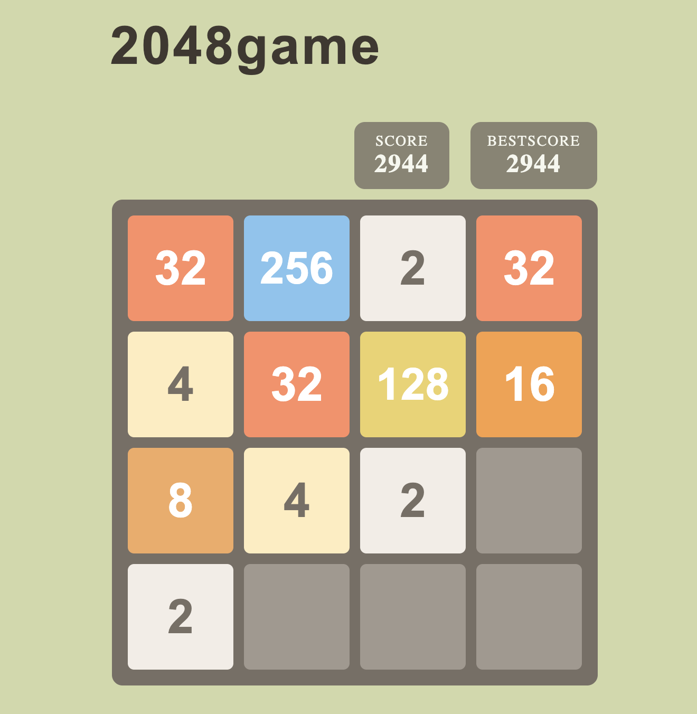

# 2048 Game – React Project
This project is a simple implementation of the **2048 game** built with **React**.
I created it to practice my React skills, including state management, game logic, and keyboard controls. 

The goal of the game is to combine tiles with the same numbers and reach **2048**. 

## Screenshots



## You can run the Project with Docker

### Step 1
```bash
git clone https://github.com/maryanaliakh/2048-game.git
```

### Step 2
```bash
docker build -t 2048 .
```
### Step 3
```bash
docker run --name 2048 -p 5173:5173 2048
```

### Step 4
Open in browser: http://localhost:5173

